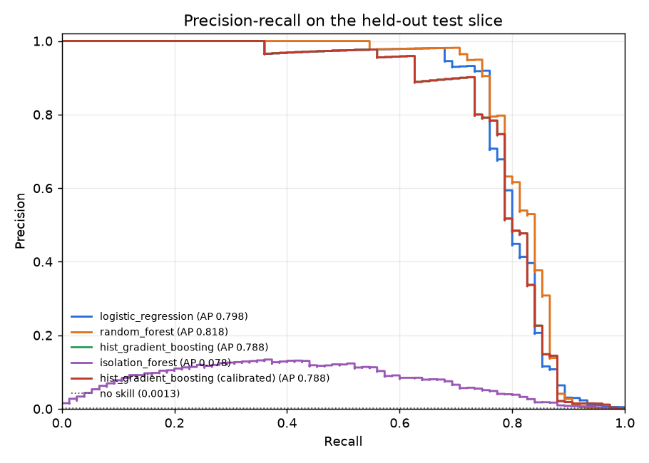
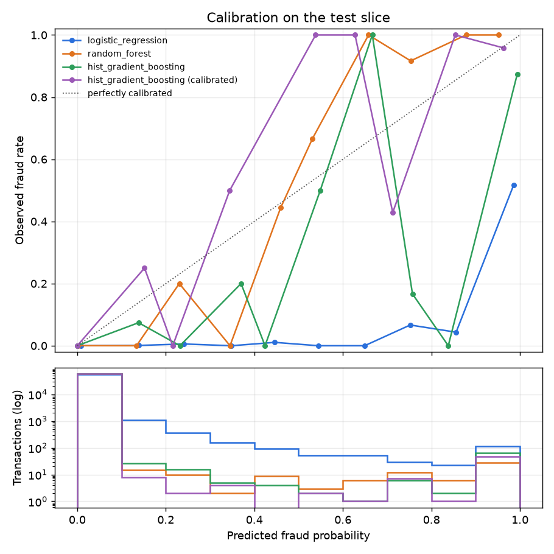
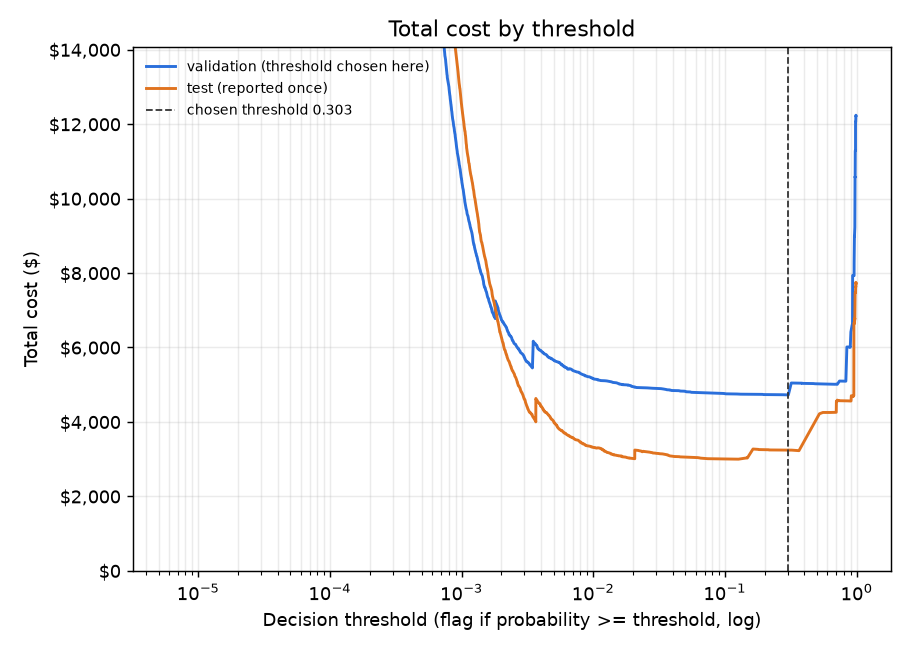
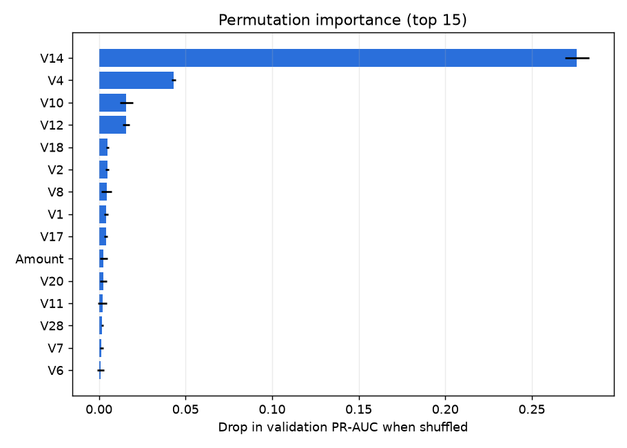

# FraudLens evaluation report

_Generated by `python -m fraudlens.evaluate`. Every number below comes from the files in
`reports/` and the training artifacts of version `76274b69-635f5ce7`._

- Data SHA-256: `76274b691b16a6c49d3f159c883398e03ccd6d1ee12d9d8ee38f4b4b98551a89`
- Code version: `5b74b1799180565b3acd8fb9b9b5f380f1e55fb3`
- Seed: 42
- Training time: 299 s; evaluation time: 150 s

## 1. Split (EV-1)

Transactions are sorted by `Time` and cut 60/20/20, with each cut moved forward to the next
distinct timestamp so no second straddles two slices.

| Slice | Rows | Frauds | Fraud rate |
|---|---|---|---|
| Train | 170,888 | 360 | 0.2107% |
| Validation | 56,958 | 57 | 0.1001% |
| Test | 56,961 | 75 | 0.1317% |

The test slice was not read until every choice below had been made on validation data.

## 2. Model search on validation (FR-4 to FR-8)

Each setting is trained on the training slice and scored by validation PR-AUC.

| Model | Settings tried | Best validation PR-AUC | Best parameters | Search time |
|---|---|---|---|---|
| logistic_regression | 6 | 0.7740 | C=10.0, sampling=undersample | 4 s |
| random_forest | 4 | 0.7687 | max_depth=16, max_features=sqrt, min_samples_leaf=3, n_estimators=250, sampling=class_weight | 117 s |
| hist_gradient_boosting | 8 | 0.7902 | l2_regularization=1.0, learning_rate=0.03, max_iter=400, max_leaf_nodes=31, min_samples_leaf=20, sampling=class_weight | 106 s |
| isolation_forest | 4 | 0.0412 | max_features=1.0, max_samples=4096, n_estimators=200 | 10 s |

## 3. Imbalance strategies (EV-5)

Validation PR-AUC for each supervised model's best parameters under each strategy.
Resampling happens inside the training pipeline only; validation and test rows are never
resampled. Undersampling and SMOTE target a minority/majority ratio of
0.1 and 0.1 respectively.

| Model | class_weight | smote | undersample |
|---|---|---|---|
| hist_gradient_boosting | **0.7902** | 0.7614 | 0.7748 |
| logistic_regression | 0.7619 | 0.7105 | **0.7740** |
| random_forest | **0.7687** | 0.7544 | 0.7613 |

## 4. Selection and calibration (FR-9)

Selected: **hist_gradient_boosting** (highest validation PR-AUC among all candidates), calibrated with
**sigmoid** scaling fitted on the validation slice. The calibration map is
monotonic, so it leaves the ranking (and PR-AUC) unchanged and only makes the scores usable
as probabilities.

## 5. Test results (EV-2 to EV-4)

| Model | Test PR-AUC (95% CI) | Recall @ 90% precision | Precision @ 80% recall | ROC-AUC | Brier | Validation PR-AUC |
|---|---|---|---|---|---|---|
| **hist_gradient_boosting (calibrated)** (served) | 0.788 (0.700–0.869) | 0.733 (0.514–0.825) | 0.517 (0.122–0.936) | 0.974 (0.940–0.994) | 0.0004 (0.0003–0.0006) | 0.790 |
| logistic_regression | 0.798 (0.708–0.879) | 0.760 (0.602–0.850) | 0.594 (0.093–0.973) | 0.984 (0.971–0.995) | 0.0040 (0.0037–0.0043) | 0.774 |
| random_forest | 0.818 (0.736–0.894) | 0.760 (0.646–0.849) | 0.632 (0.124–0.986) | 0.950 (0.914–0.985) | 0.0004 (0.0003–0.0006) | 0.769 |
| hist_gradient_boosting | 0.788 (0.700–0.869) | 0.733 (0.514–0.825) | 0.517 (0.122–0.936) | 0.974 (0.940–0.994) | 0.0005 (0.0004–0.0007) | 0.790 |
| isolation_forest | 0.078 (0.056–0.109) | 0.000 (0.000–0.000) | 0.040 (0.014–0.076) | 0.957 (0.933–0.978) | 0.1373 (0.1371–0.1375) | 0.041 |

Paired bootstrap of the PR-AUC difference, `hist_gradient_boosting (calibrated)` minus each other model, on the same resampled test rows:

- vs `logistic_regression`: PR-AUC difference -0.010 (95% CI -0.037 to +0.015), not significantly different.
- vs `random_forest`: PR-AUC difference -0.030 (95% CI -0.062 to -0.005), **significantly different**.
- vs `isolation_forest`: PR-AUC difference +0.710 (95% CI +0.634 to +0.781), **significantly different**.

**The model chosen on validation is not the best on test:** `random_forest` scored significantly higher on the test slice. The served model is kept anyway: it was selected by validation PR-AUC before the test slice was read, and switching now would be choosing a model on test data, which would make the test numbers optimistic. With so few validation frauds, model selection is itself noisy; this is reported as a finding, not corrected.

ROC-AUC is reported for completeness only. With so few frauds, the false-positive rate's denominator is huge, so ROC-AUC stays high even for a model that is of little use: `isolation_forest` reaches ROC-AUC 0.957 but PR-AUC only 0.078.

Why not accuracy: predicting "legitimate" for every test transaction scores **99.87% accuracy** and catches none of the 75 frauds. The served model scores 99.95% and catches 55. Accuracy separates them by 0.08 percentage points, so it is reported only to make this point, never to compare models.

## 6. Cost-based threshold (EV-7)

Cost model (`config.yaml`): a missed fraud costs the transaction amount; a false alarm costs
$5 (one review); a caught fraud costs
$5 (it is reviewed too). The threshold that minimised total
cost on validation was applied unchanged to the test slice.

Decision threshold **0.3032** (chosen on validation to minimise cost).

| | Flagged | Allowed |
|---|---|---|
| Fraud | 55 (caught) | 20 (missed) |
| Legitimate | 8 (false alarms) | 56,878 |

| Policy on the test slice | Total cost | Saving by the model (95% CI) |
|---|---|---|
| Flag nothing | $7,729 | $4,488; 58.1% (CI 26.2–82.9%) |
| Flag everything | $284,805 | $281,564; 98.9% (CI 97.8–99.6%) |
| **hist_gradient_boosting (calibrated)** at the chosen threshold | **$3,241** | |

On validation, the chosen threshold cost $4,725 with
43 frauds caught, 14 missed and
7 false alarms. Test frauds totalled
$7,729; the money figures describe this dataset only.

## 7. Explainability (FR-13, FR-14)

Top 10 by permutation importance (drop in validation PR-AUC): `V14` (0.276), `V4` (0.043), `V10` (0.016), `V12` (0.016), `V18` (0.005), `V2` (0.005), `V8` (0.004), `V1` (0.004), `V17` (0.004), `Amount` (0.003).

`V1`–`V28` are anonymised PCA components, so these rankings say *which component* carries
signal, not *what it means* in business terms. `Time` enters the model only as the hour of
day and `Amount` as log1p(Amount). The API returns per-transaction contributions computed by
replacing each input with its training median and re-scoring.

## 8. All test metrics

| Model | Metric | Value | 95% CI |
|---|---|---|---|
| logistic_regression | pr_auc | 0.7975 | 0.7081 – 0.8794 |
| logistic_regression | recall_at_90pct_precision | 0.76 | 0.6023 – 0.85 |
| logistic_regression | precision_at_80pct_recall | 0.5941 | 0.09319 – 0.9726 |
| logistic_regression | roc_auc | 0.9837 | 0.9706 – 0.995 |
| logistic_regression | brier | 0.004015 | 0.003666 – 0.00434 |
| logistic_regression | accuracy | 0.9995 | 0.9994 – 0.9997 |
| logistic_regression | precision_at_threshold | 0.9455 | 0.8772 – 1 |
| logistic_regression | recall_at_threshold | 0.6933 | 0.5833 – 0.7922 |
| logistic_regression | total_cost | 3212 | 1041 – 6177 |
| logistic_regression | savings_vs_flag_nothing_pct | 58.44 | 26.55 – 83.38 |
| logistic_regression | savings_vs_flag_everything_pct | 98.87 | 97.83 – 99.63 |
| logistic_regression | tp | 52 |  |
| logistic_regression | fp | 3 |  |
| logistic_regression | fn | 23 |  |
| logistic_regression | tn | 56,883 |  |
| random_forest | pr_auc | 0.8178 | 0.7363 – 0.8944 |
| random_forest | recall_at_90pct_precision | 0.76 | 0.6461 – 0.8485 |
| random_forest | precision_at_80pct_recall | 0.6316 | 0.1237 – 0.9861 |
| random_forest | roc_auc | 0.9504 | 0.9136 – 0.9851 |
| random_forest | brier | 0.000411 | 0.0002824 – 0.0005576 |
| random_forest | accuracy | 0.9996 | 0.9994 – 0.9997 |
| random_forest | precision_at_threshold | 0.8906 | 0.8077 – 0.9655 |
| random_forest | recall_at_threshold | 0.76 | 0.6622 – 0.8525 |
| random_forest | total_cost | 2958 | 810.9 – 5835 |
| random_forest | savings_vs_flag_nothing_pct | 61.73 | 29.45 – 87.31 |
| random_forest | savings_vs_flag_everything_pct | 98.96 | 97.95 – 99.72 |
| random_forest | tp | 57 |  |
| random_forest | fp | 7 |  |
| random_forest | fn | 18 |  |
| random_forest | tn | 56,879 |  |
| hist_gradient_boosting | pr_auc | 0.788 | 0.7002 – 0.869 |
| hist_gradient_boosting | recall_at_90pct_precision | 0.7333 | 0.5139 – 0.825 |
| hist_gradient_boosting | precision_at_80pct_recall | 0.5172 | 0.1217 – 0.9355 |
| hist_gradient_boosting | roc_auc | 0.9739 | 0.94 – 0.9936 |
| hist_gradient_boosting | brier | 0.0005499 | 0.0003887 – 0.000733 |
| hist_gradient_boosting | accuracy | 0.9995 | 0.9993 – 0.9997 |
| hist_gradient_boosting | precision_at_threshold | 0.873 | 0.7857 – 0.9538 |
| hist_gradient_boosting | recall_at_threshold | 0.7333 | 0.625 – 0.8293 |
| hist_gradient_boosting | total_cost | 3241 | 1088 – 6187 |
| hist_gradient_boosting | savings_vs_flag_nothing_pct | 58.07 | 26.23 – 82.86 |
| hist_gradient_boosting | savings_vs_flag_everything_pct | 98.86 | 97.83 – 99.62 |
| hist_gradient_boosting | tp | 55 |  |
| hist_gradient_boosting | fp | 8 |  |
| hist_gradient_boosting | fn | 20 |  |
| hist_gradient_boosting | tn | 56,878 |  |
| isolation_forest | pr_auc | 0.07755 | 0.05552 – 0.1095 |
| isolation_forest | recall_at_90pct_precision | 0 | 0 – 0 |
| isolation_forest | precision_at_80pct_recall | 0.03974 | 0.0137 – 0.07634 |
| isolation_forest | roc_auc | 0.9575 | 0.9327 – 0.9778 |
| isolation_forest | brier | 0.1373 | 0.1371 – 0.1375 |
| isolation_forest | accuracy | 0.9932 | 0.9925 – 0.9939 |
| isolation_forest | precision_at_threshold | 0.1066 | 0.07728 – 0.1379 |
| isolation_forest | recall_at_threshold | 0.56 | 0.4428 – 0.6761 |
| isolation_forest | total_cost | 5393 | 3107 – 8451 |
| isolation_forest | savings_vs_flag_nothing_pct | 30.22 | -15.84 – 59.31 |
| isolation_forest | savings_vs_flag_everything_pct | 98.11 | 97.03 – 98.91 |
| isolation_forest | tp | 42 |  |
| isolation_forest | fp | 352 |  |
| isolation_forest | fn | 33 |  |
| isolation_forest | tn | 56,534 |  |
| hist_gradient_boosting (calibrated) | pr_auc | 0.788 | 0.7002 – 0.869 |
| hist_gradient_boosting (calibrated) | recall_at_90pct_precision | 0.7333 | 0.5139 – 0.825 |
| hist_gradient_boosting (calibrated) | precision_at_80pct_recall | 0.5172 | 0.1217 – 0.9355 |
| hist_gradient_boosting (calibrated) | roc_auc | 0.9739 | 0.94 – 0.9936 |
| hist_gradient_boosting (calibrated) | brier | 0.0004424 | 0.0002915 – 0.0006166 |
| hist_gradient_boosting (calibrated) | accuracy | 0.9995 | 0.9993 – 0.9997 |
| hist_gradient_boosting (calibrated) | precision_at_threshold | 0.873 | 0.7857 – 0.9538 |
| hist_gradient_boosting (calibrated) | recall_at_threshold | 0.7333 | 0.625 – 0.8293 |
| hist_gradient_boosting (calibrated) | total_cost | 3241 | 1088 – 6187 |
| hist_gradient_boosting (calibrated) | savings_vs_flag_nothing_pct | 58.07 | 26.23 – 82.86 |
| hist_gradient_boosting (calibrated) | savings_vs_flag_everything_pct | 98.86 | 97.83 – 99.62 |
| hist_gradient_boosting (calibrated) | tp | 55 |  |
| hist_gradient_boosting (calibrated) | fp | 8 |  |
| hist_gradient_boosting (calibrated) | fn | 20 |  |
| hist_gradient_boosting (calibrated) | tn | 56,878 |  |

## 9. Limitations

- Two days of 2013 transactions from one European issuer. Nothing here is evidence of
  performance on another portfolio, another period, or in production.
- The test slice holds only 75 frauds, so every interval is wide; small
  differences between models are noise unless the paired interval excludes zero.
- PCA features limit explanations to component names.
- Labels are taken as given and arrive instantly; real fraud labels arrive weeks later and
  are incomplete (unreported fraud), and fraud patterns drift.
- One global threshold is used, as specified. Because a missed fraud costs its amount, an
  amount-aware rule (flag when probability × amount exceeds the review cost) would likely do
  better; it is left as a next step.
